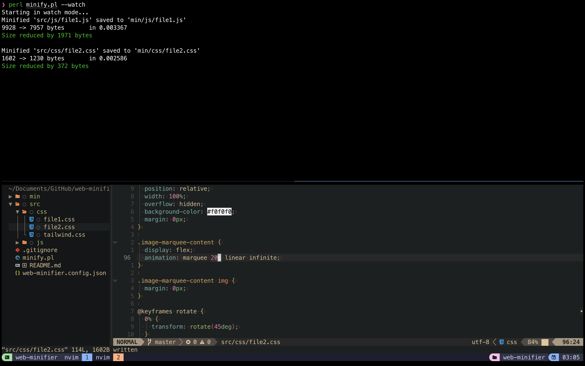
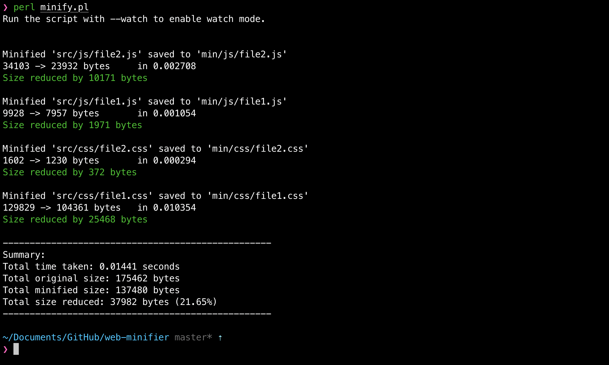

# Web Minifier (Perl script)

This script minifies JavaScript and CSS files by removing comments, unnecessary whitespace, and optimizing values. It can be run in both one-time mode or in a watch mode that automatically processes files when they are modified or created.

## Usage

### Prerequisites

Perl (most of the computers have it pre-installed).

### Configuration

Create a configuration file called `web-minifier.config.json` in the same directory as the script. This file should contain the following structure:

```json
{
  "js": {
    "input": "path/to/js/input",
    "output": "path/to/js/output",
    "ignore": ["file1.js", "file2.js"]
  },
  "css": {
    "input": "path/to/css/input",
    "output": "path/to/css/output",
    "ignore": ["file1.css", "file2.css"]
  }
}
```

- `input`: The directory where the JavaScript or CSS files are located.
- `output`: The directory where the minified files will be saved.
- `ignore`: A list of files to ignore from minification.

### Running the Script

1. **One-time Minification**:
   You can run the script by passing a single JS or CSS file as a parameter:

   ```bash
   perl minify.pl
   ```

   This will process and minify the specified file.

   You can also provide a single file as a parameter, and the script will process and minify it once.

   ```bash
   perl minify.pl somefile.js
   ```

2. **Watch Mode**:
   To run the script in watch mode, use the `--watch` flag. This will keep the script running and automatically process any changes to `.js` or `.css` files in the specified input directories:

   ```bash
   perl minify.pl --watch
   ```

   The script will display logs when files are modified or created and automatically minify them.

# screenshots



